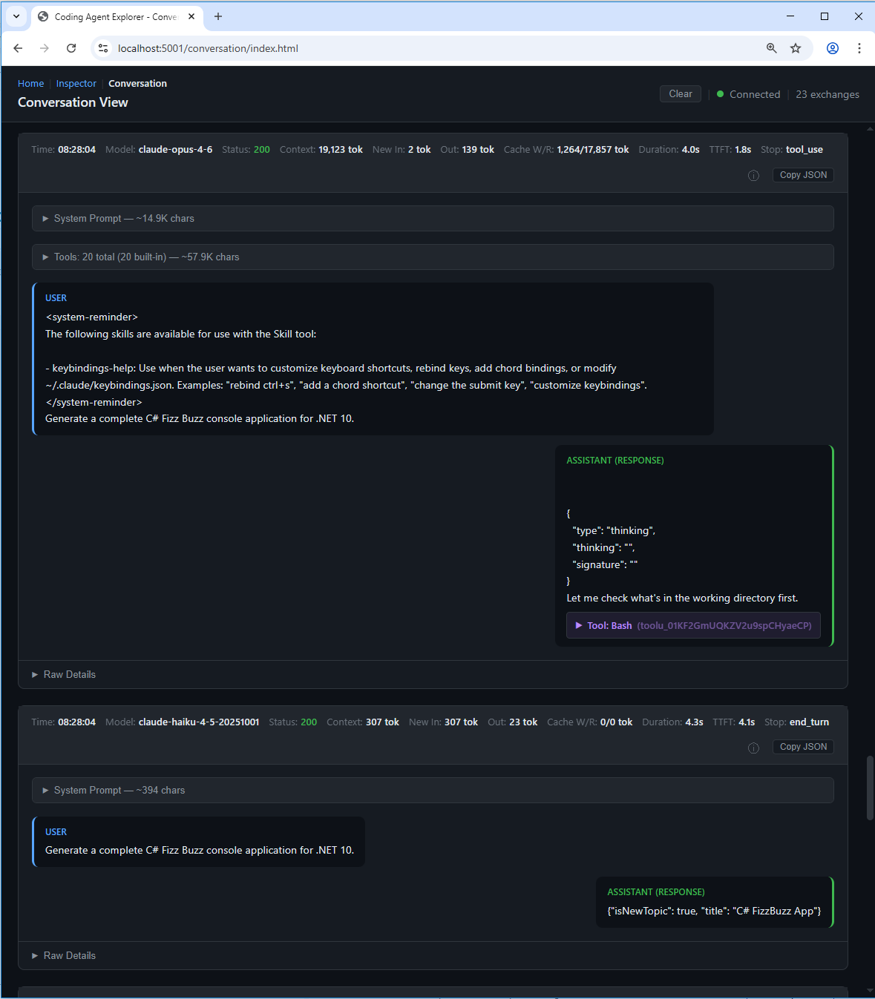
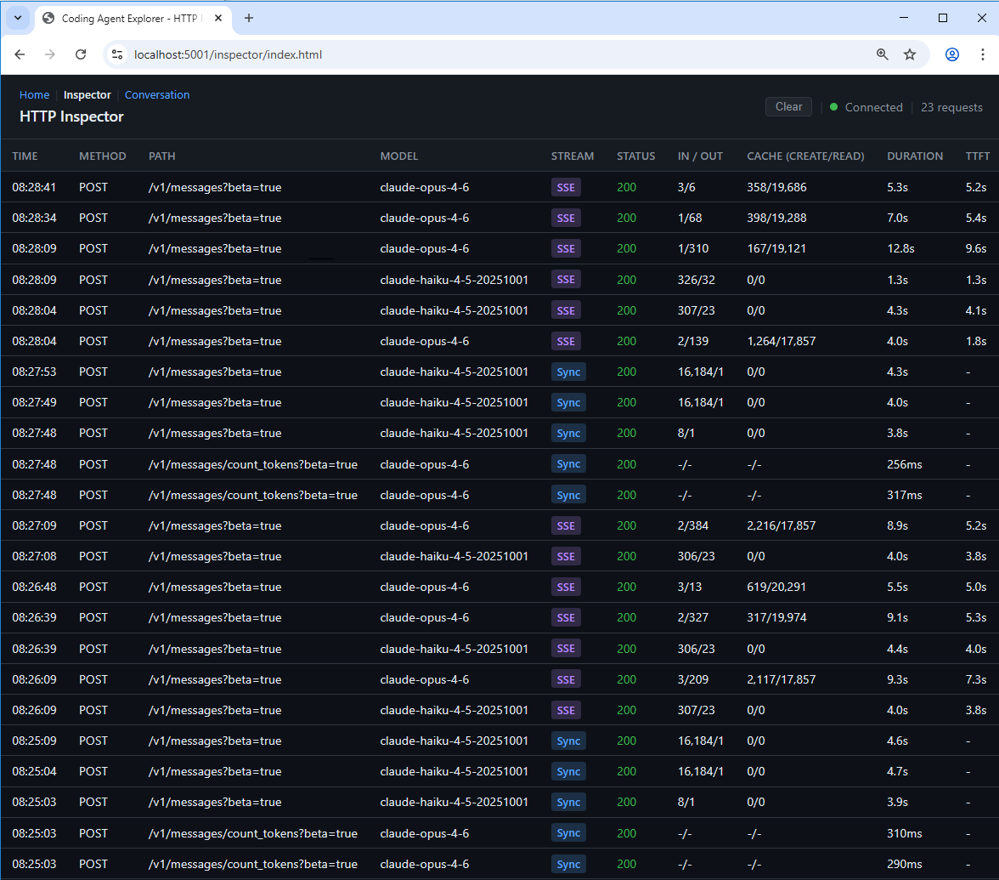
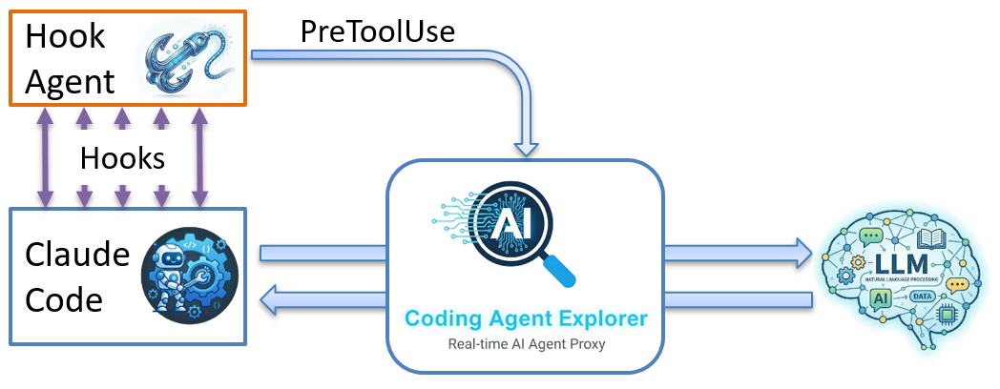
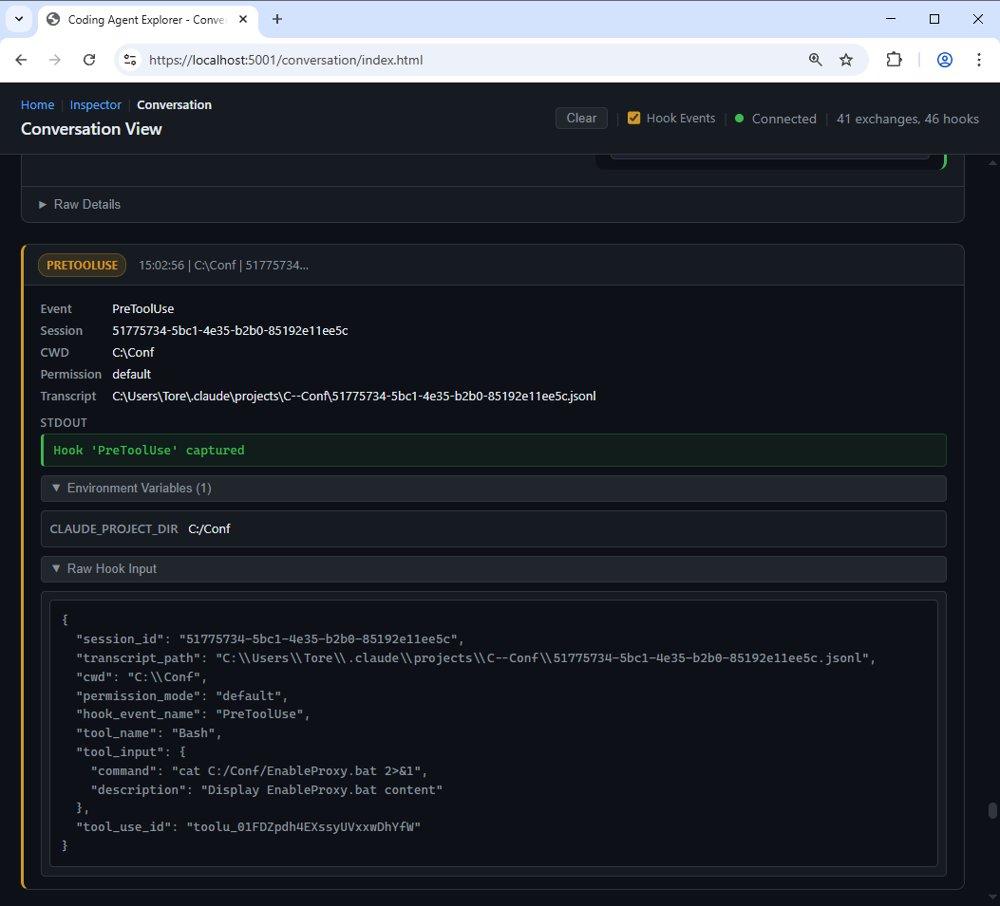

# Coding Agent Explorer

A real-time .NET proxy and dashboard for inspecting Claude Code API calls. Intercept, visualize, and analyze every request and response between Claude Code and the Anthropic API.

Built as a teaching tool for [Tore Nestenius'](https://tn-data.se/) AI agent [Workshops and presentations](https://tn-data.se/courses/), helping developers understand what happens under the hood when AI coding agents work.


> **Note:** Currently supports [Claude Code](https://docs.anthropic.com/en/docs/claude-code) with the Anthropic API. Support for additional coding agents may be added in the future.




The agentic conversation view allows you to explore the conversation with the LLM models.



The HTTP Inspector view lets you examine every API request and response in detail, including headers, bodies, and streaming SSE events.

## Read More

Want to learn more about the architecture and design decisions behind this project? Check out the detailed blog post: [Introducing the Coding Agent Explorer .NET](https://nestenius.se/ai/introducing-the-coding-agent-explorer-net/)

## What It Does

Coding Agent Explorer sits between your coding agent and the LLM API, capturing all traffic and displaying it in a real-time web dashboard. You can see:

- Every API request and response in real time
- Streaming SSE events as they arrive
- Token usage (input, output, cache creation, cache reads)
- Model selection, timing, and time-to-first-token
- Full request/response headers and bodies
- A conversation view that renders the agent's messages in a chat-style format

## Prerequisites

- [.NET 10 SDK](https://dotnet.microsoft.com/download) or later

## Getting Started

### 1. Build and run the proxy

```bash
dotnet build
dotnet run
```

This starts three endpoints:
- **Port 8888** - The reverse proxy (HTTP, point your coding agent here)
- **Port 5000** - The web dashboard (HTTP)
- **Port 5001** - The web dashboard (HTTPS, auto-launches in browser)

### 2. Configure your coding agent

For **Claude Code**, set the API base URL to point at the proxy:

```bash
# Linux / macOS
export ANTHROPIC_BASE_URL=http://localhost:8888

# Windows (cmd)
set ANTHROPIC_BASE_URL=http://localhost:8888

# Windows (PowerShell)
$env:ANTHROPIC_BASE_URL = "http://localhost:8888"
```

On Windows, you can also run `EnableProxy.bat` from the repo root to quickly set the variable. Run `DisableProxy.bat` to clear it. Both scripts only affect the current cmd session -- the variable is not persisted, so closing the terminal automatically clears it.

Then use Claude Code as you normally would.

### 3. Open the dashboard

Navigate to [https://localhost:5001](https://localhost:5001) in your browser (opens automatically on `dotnet run`). You'll see two views:

- **HTTP Inspector** - Table view of all proxied requests with headers, bodies, SSE events, and timing details
- **Conversation View** - Chat-style display showing messages, tool use, and responses

## Publishing

Run `publish.bat` from the repo root to build release artifacts into `Published/` (gitignored):

```bat
publish.bat
```

| Output | Description |
|--------|-------------|
| `Published\CodingAgentExplorer\` | Proxy + dashboard (exe, wwwroot, appsettings.json) |
| `Published\HookAgent\HookAgent.exe` | Single-file Claude Code hook command (win-x64) |

Both require the .NET 10 runtime on the target machine. Add `Published\HookAgent` to your `PATH` to use `HookAgent` as a Claude Code hook command.

## HookAgent

HookAgent is a small companion CLI tool that acts as a [Claude Code hook](https://docs.anthropic.com/en/docs/claude-code/hooks) command. It bridges Claude Code's hook system and the CodingAgentExplorer dashboard, letting you see every hook event (session start/end, tool calls, permission requests, notifications, and more) appear in the conversation view in real time.

### How it works



Claude Code invokes hook commands by writing a JSON payload to **stdin** and reading the exit code and stdout/stderr on completion. HookAgent:

1. Reads the JSON payload from stdin
2. Collects Claude Code environment variables (`CLAUDE_PROJECT_DIR`, `CLAUDE_ENV_FILE`, etc.)
3. POSTs everything to the dashboard at `http://localhost:5000/api/hook-event`
4. Relays the server's `exitCode`, `stdout`, and `stderr` back to Claude Code
5. Exits silently with code 0 if the dashboard is not running, so it never blocks Claude Code

### Setup for a workshop / demo

**Step 1:** Run `publish.bat` to build `Published/HookAgent/HookAgent.exe`.

**Step 2:** Copy the `HookAgent/` folder into the working directory where students will run `claude`:

```
C:\Conf\
  HookAgent\
    HookAgent.exe
  .claude\
    settings.json    ← copied from sample-settings.json in this repo
```

**Step 3:** Copy `sample-settings.json` from the repo root to `.claude\settings.json` in the working directory. This file registers HookAgent for all 15 Claude Code hook events.

**Step 4:** Start CodingAgentExplorer, then run `claude` from the working directory. Hook events appear in the Conversation View alongside API requests.

> **Note:** Claude Code runs hook commands through **bash** on all platforms (including Windows). Use forward slashes in the command path: `HookAgent/HookAgent.exe`.

### Verify it works

Test HookAgent manually before starting a Claude Code session:

```bash
echo '{"hook_event_name":"UserPromptSubmit","session_id":"test"}' | HookAgent/HookAgent.exe
```

If the dashboard is running, a `UserPromptSubmit` event appears in the Conversation View immediately. If the dashboard is not running, the command exits silently with code 0.

### Example



Hook events appear inline in the Conversation View, interleaved with API requests in chronological order. Each event shows the event type, timestamp, session, and any stdout returned by the dashboard.

### Hook events captured

| Event | When it fires |
|---|---|
| `SessionStart` | Claude Code session begins or resumes |
| `UserPromptSubmit` | User submits a prompt |
| `PreToolUse` | Before any tool call executes |
| `PostToolUse` | After a tool call succeeds |
| `PostToolUseFailure` | After a tool call fails |
| `PermissionRequest` | When Claude Code asks for permission |
| `Stop` | Claude finishes responding |
| `SubagentStart` / `SubagentStop` | A subagent is spawned or finishes |
| `Notification` | Claude Code sends a notification |
| `PreCompact` | Before context compaction |
| `ConfigChange` | A settings file changes during the session |
| `TeammateIdle` / `TaskCompleted` | Agent team events |
| `SessionEnd` | Session terminates |

## Architecture

```
  Coding Agent  ──►  CodingAgentExplorer (port 8888)  ──►  LLM API
                            │
                            ▼
                     Web Dashboard (port 5000/5001)
                     Real-time via SignalR
```

- ASP.NET Core with [YARP](https://github.com/microsoft/reverse-proxy) reverse proxy
- SignalR for real-time dashboard updates
- Vanilla HTML/JS/CSS frontend (no build step required)
- Single NuGet dependency (`Yarp.ReverseProxy`)

## Project Structure

```
├── publish.bat                         # Publishes both projects to Published/
├── CodingAgentExplorer/
│   ├── Program.cs                      # App setup: YARP, SignalR, dual-port Kestrel
│   ├── Models/                         # DTOs: ProxiedRequest, ClaudeRequestBody, SseEvent, HookEvent
│   ├── Services/RequestStore.cs        # In-memory circular buffer (max 1000 requests)
│   ├── Services/HookEventStore.cs      # In-memory store for hook events
│   ├── Proxy/CaptureTransformProvider.cs  # YARP ITransformProvider for request/response capture
│   ├── Hubs/DashboardHub.cs            # SignalR hub for real-time dashboard updates
│   └── wwwroot/                        # Dashboard SPA (vanilla HTML/JS/CSS)
│       ├── index.html                  # Landing page with view selection
│       ├── inspector/                  # HTTP Inspector view
│       ├── conversation/               # Conversation view
│       ├── css/                        # Stylesheets
│       └── js/                         # Dashboard and conversation scripts
└── HookAgent/                          # Single-file CLI tool for Claude Code hooks
```


## Security

- API keys (`x-api-key` and `Authorization` headers) are automatically redacted from stored request data
- The proxy only listens on `localhost` - it is not exposed to the network
- Request data is stored in memory only (max 1000 requests, no persistence)

## About the author

This tool was developed by [Tore Nestenius](https://nestenius.se/), a seasoned .NET instructor and consultant with over 25 years of experience in software development and architecture. With extensive 
expertise in .NET, Azure, and cloud computing, Tore is passionate about helping developers and organizations build robust software solutions and optimize their development processes. A frequent 
speaker at conferences and user groups, Tore actively shares his knowledge and insights with the community, fostering learning and growth for developers worldwide.

* [Stack Overflow](https://stackoverflow.com/users/68490/tore-nestenius)
* [LinkedIn](https://www.linkedin.com/in/torenestenius/)
* [Blog](https://nestenius.se/)
* [Company](https://tn-data.se/)


## Other Projects by the Author

- [CloudDebugger](https://github.com/tndata/CloudDebugger) - A .NET web application designed to explore and learn about various Azure services and features, including authentication, configuration, networking, and more.

## Want to learn more about AI agents?

Join one of Tore's workshops for programmers at [tn-data.se/courses](https://tn-data.se/courses/) to deepen your understanding of AI coding agents, .NET development, and cloud architecture.

## License

This project is licensed under the [MIT License](LICENSE).
