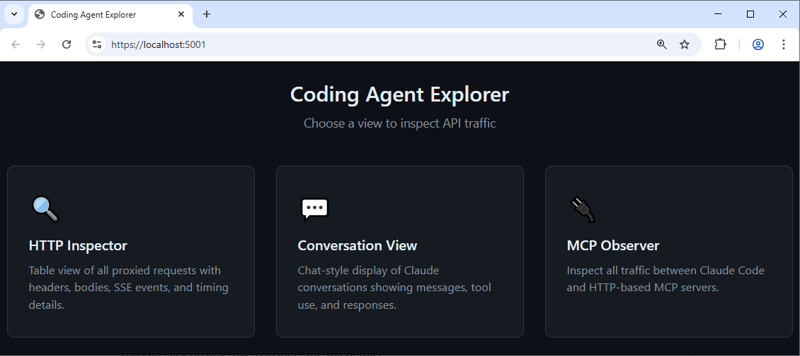
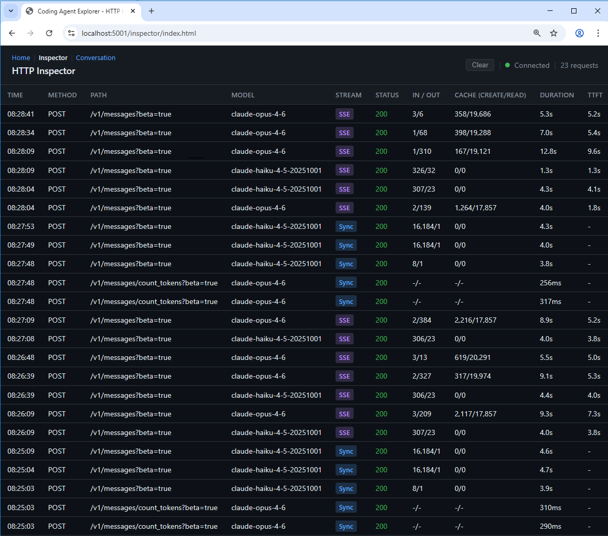
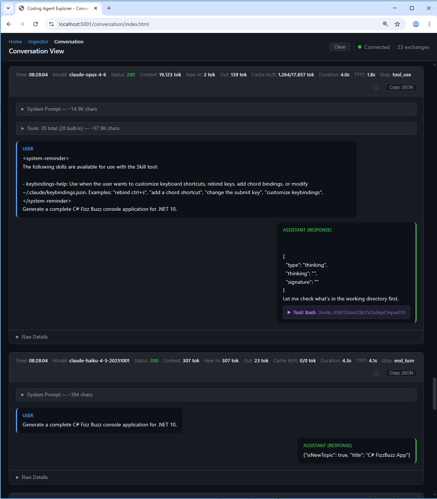
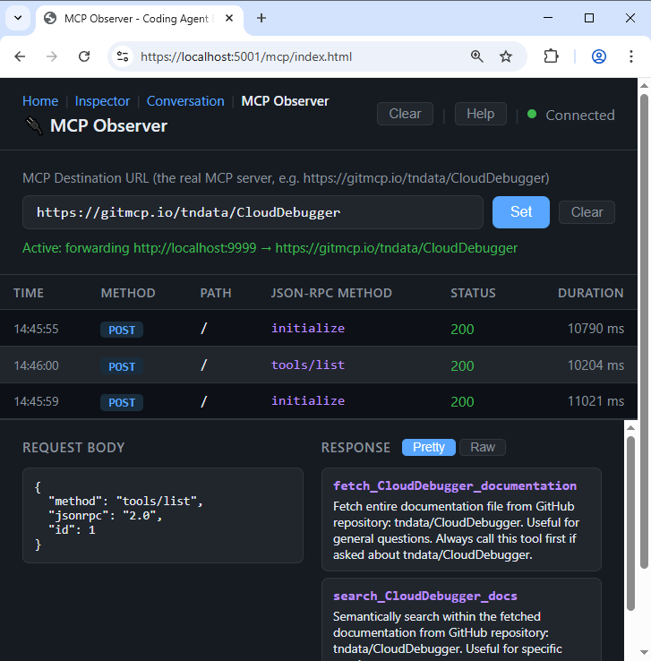
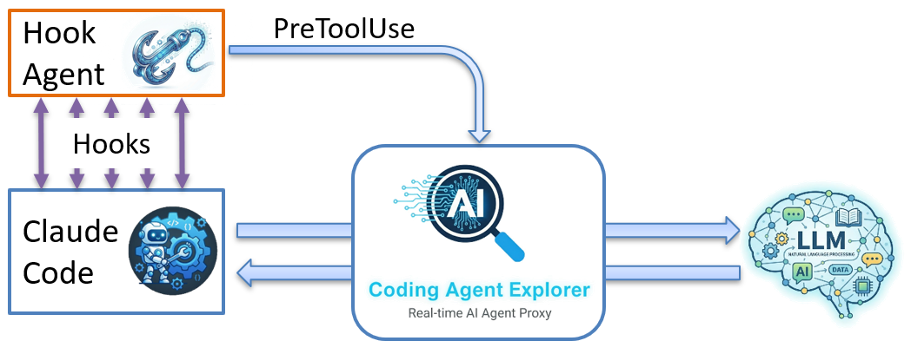
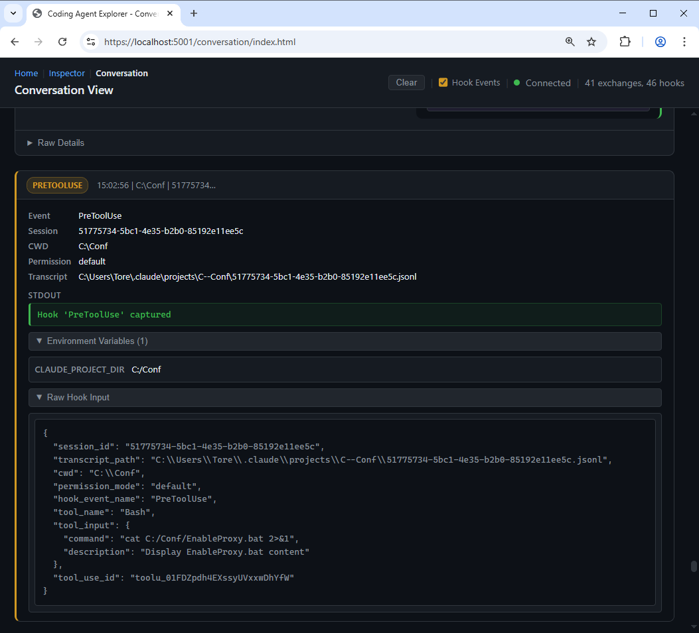

# Coding Agent Explorer

A real-time .NET proxy and dashboard for inspecting Claude Code API calls. Intercept, visualize, and analyze every request and response between Claude Code and the Anthropic API.

With Coding Agent Explorer, you can:

- See every API request and response between Claude Code and the Anthropic API in real time
- Inspect full request/response headers, bodies, and streaming SSE events
- Track token usage, model selection, and time-to-first-token
- Follow the conversation as a readable chat-style timeline
- Capture and inspect MCP tool calls between Claude Code and HTTP-based MCP servers
- Monitor Claude Code hook events alongside API traffic


## Dashboard

The dashboard offers three views for inspecting your coding agent's activity: HTTP Inspector, Conversation View, and MCP Observer.



## HTTP Inspector

Every API request and response is captured and displayed in a table with full headers, request and response bodies, streaming SSE events, token usage, and timing details.



## Conversation View

The Conversation View renders the raw API traffic as a readable chat-style timeline, showing messages, tool calls, responses, and hook events in the order they occurred.



## MCP Observer

The MCP Observer acts as a proxy between Claude Code and any HTTP-based MCP server. Configure the destination URL and all MCP traffic is captured and displayed in real time. The MCP Observer will be covered in a future blog post.



## Read More

Want to learn more about this project? Check out the blog posts:

- [Introducing the Coding Agent Explorer .NET](https://nestenius.se/ai/introducing-the-coding-agent-explorer-net/)
- [Exploring Claude Code Hooks with the Coding Agent Explorer (.NET)](https://nestenius.se/ai/exploring-claude-code-hooks-with-the-coding-agent-explorer-net/)

## Prerequisites

- [.NET 10 SDK](https://dotnet.microsoft.com/download) or later

## Getting Started

### 1. Install .NET 10 SDK

Download and install the [.NET 10 SDK](https://dotnet.microsoft.com/download) if you do not already have it.

### 2. Clone the repository

```bash
git clone https://github.com/tndata/CodingAgentExplorer.git
cd CodingAgentExplorer
```

### 3. Build and run

```bash
dotnet build
dotnet run --project CodingAgentExplorer
```

This starts four endpoints:
- **Port 8888** - The reverse proxy (HTTP, point your coding agent here)
- **Port 9999** - The MCP proxy (HTTP, used by the MCP Observer)
- **Port 5000** - The web dashboard (HTTP)
- **Port 5001** - The web dashboard (HTTPS, auto-launches in browser)

### 4. Configure your coding agent

For **Claude Code**, set the `ANTHROPIC_BASE_URL` environment variable to point at the proxy.

**Linux / macOS:**

Use `source` (not `bash`) so the variable is exported to your current shell:

```bash
source EnableProxy.sh
```

Run `source DisableProxy.sh` to clear it when you are done.

**Windows (cmd):**

```bat
EnableProxy.bat
```

Run `DisableProxy.bat` to clear it.

**Windows (PowerShell):**

```powershell
# Enable
$env:ANTHROPIC_BASE_URL = "http://localhost:8888"

# Disable
Remove-Item Env:ANTHROPIC_BASE_URL
```

All scripts only affect the current terminal session. The variable is not persisted, so closing the terminal automatically clears it.

Then use Claude Code as you normally would.

### 5. Open the dashboard

Navigate to [https://localhost:5001](https://localhost:5001) in your browser. On Windows the browser opens automatically on `dotnet run`. On macOS and Linux, open it manually.

You will see three views:

- **HTTP Inspector** - Table view of all proxied requests with headers, bodies, SSE events, and timing details
- **Conversation View** - Chat-style display showing messages, tool use, and responses
- **MCP Observer** - Dedicated view for inspecting MCP server traffic (see below)

## MCP Observer

The MCP Observer lets you intercept and inspect traffic between Claude Code and any [Model Context Protocol (MCP)](https://modelcontextprotocol.io/) server. It acts as a transparent proxy on port 9999, sitting between Claude Code and the real MCP server.

```
Claude Code  --►  MCP Observer (port 9999)  --►  Real MCP Server
                         |
                         ▼
                  Dashboard (port 5000/5001)
```

### What it shows

- Every MCP request and response in real time, sorted chronologically
- The JSON-RPC method for each request (`initialize`, `tools/list`, `tools/call`, etc.)
- For `tools/call`, the specific tool name is shown inline, e.g. `tools/call (query-docs)`
- A Pretty view that renders responses in a readable format per method type:
  - `tools/list` - one card per tool with name, description, and parameters
  - `initialize` - protocol version, server name, and capabilities
  - `tools/call` - the returned content rendered directly
- A Raw view with pretty-printed JSON for all other responses
- Request and response bodies side by side

### Setup

**Step 1:** Open the MCP Observer at [https://localhost:5001/mcp/index.html](https://localhost:5001/mcp/index.html).

**Step 2:** Enter the URL of the real MCP server in the destination field and click Set.

**Step 3:** Register the proxy as an MCP server in Claude Code:

```bash
claude mcp add --transport http mcp_proxy http://localhost:9999
```

Claude Code will now route all MCP traffic through the observer. To remove it later:

```bash
claude mcp remove mcp_proxy
```

### Sample MCP services to try

| Service | URL | Sample prompt |
|---------|-----|---------------|
| Microsoft Learn | `https://learn.microsoft.com/api/mcp` | "How do I create an Azure Container App using az cli?" |
| Context7 | `https://mcp.context7.com/mcp` | "How do I set up middleware in Next.js 15? use context7" |

## Publishing

Run the publish script from the repo root to build release artifacts into `Published/` (gitignored). Each script builds both projects for the current platform.

**Windows:**
```bat
publish.bat
```

| Output | Description |
|--------|-------------|
| `Published\CodingAgentExplorer\` | Proxy + dashboard (exe, wwwroot, appsettings.json) |
| `Published\HookAgent\HookAgent.exe` | HookAgent (win-x64, single-file) |

**macOS / Linux:**
```bash
bash publish.sh
```

| Output | Description |
|--------|-------------|
| `Published/CodingAgentExplorer/` | Proxy + dashboard (exe, wwwroot, appsettings.json) |
| `Published/HookAgent/HookAgent` | HookAgent (current platform, single-file) |

All outputs require the .NET 10 runtime on the target machine. Add `Published/HookAgent` to your `PATH` to use `HookAgent` as a Claude Code hook command.

## HookAgent

HookAgent is a small companion CLI tool that acts as a [Claude Code hook](https://docs.anthropic.com/en/docs/claude-code/hooks) command. It bridges Claude Code's hook system and the CodingAgentExplorer dashboard, letting you see every hook event (session start/end, tool calls, permission requests, notifications, and more) appear in the conversation view in real time.

> Read more: [Exploring Claude Code Hooks with the Coding Agent Explorer (.NET)](https://nestenius.se/ai/exploring-claude-code-hooks-with-the-coding-agent-explorer-net/)

### How it works



Claude Code invokes hook commands by writing a JSON payload to **stdin** and reading the exit code and stdout/stderr on completion. HookAgent:

1. Reads the JSON payload from stdin
2. Collects Claude Code environment variables (`CLAUDE_PROJECT_DIR`, `CLAUDE_ENV_FILE`, etc.)
3. POSTs everything to the dashboard at `http://localhost:5000/api/hook-event`
4. Relays the server's `exitCode`, `stdout`, and `stderr` back to Claude Code
5. Exits silently with code 0 if the dashboard is not running, so it never blocks Claude Code

### Setup on Windows

**Step 1:** Run `publish.bat` to build both projects.

**Step 2:** Copy `Published\HookAgent\` into the working directory where students will run `claude`. You can also add it to your `PATH` so the command is available globally.

```
C:\MyProject\
  HookAgent\
    HookAgent.exe
  .claude\
    settings.json
```

**Step 3:** Copy `HookAgent\Sample-Settings-Windows\settings.json` from the repo to `.claude\settings.json` in the working directory. This registers HookAgent for all 15 Claude Code hook events.

**Step 4:** Start CodingAgentExplorer, then run `claude` from the working directory. Hook events appear in the Conversation View alongside API requests.

> **Note:** Claude Code runs hook commands through bash on Windows too. Always use forward slashes in the command path: `HookAgent/HookAgent.exe`.

### Setup on macOS / Linux

**Step 1:** Run `bash publish.sh` to build both projects for your platform.

**Step 2:** Copy `Published/HookAgent/` into the working directory where students will run `claude`. You can also add it to your `PATH` so the command is available globally.

```
~/MyProject/
  HookAgent/
    HookAgent
  .claude/
    settings.json
```

**Step 3:** Copy `HookAgent/Sample-Settings-LinuxMacOS/settings.json` from the repo to `.claude/settings.json` in the working directory. This registers HookAgent for all 15 Claude Code hook events.

**Step 4:** Start CodingAgentExplorer, then run `claude` from the working directory. Hook events appear in the Conversation View alongside API requests.

### Verify it works

Test HookAgent manually before starting a Claude Code session:

```bash
echo '{"hook_event_name":"UserPromptSubmit","session_id":"test"}' | HookAgent/HookAgent.exe
```

If the dashboard is running, a `UserPromptSubmit` event appears in the Conversation View immediately. If the dashboard is not running, the command exits silently with code 0.

### Example



Hook events appear inline in the Conversation View, interleaved with API requests in chronological order. Each event shows the event type, timestamp, session, and any stdout returned by the dashboard.

### Hook events captured

| Event | When it fires |
|---|---|
| `SessionStart` | Claude Code session begins or resumes |
| `UserPromptSubmit` | User submits a prompt |
| `PreToolUse` | Before any tool call executes |
| `PostToolUse` | After a tool call succeeds |
| `PostToolUseFailure` | After a tool call fails |
| `PermissionRequest` | When Claude Code asks for permission |
| `Stop` | Claude finishes responding |
| `SubagentStart` / `SubagentStop` | A subagent is spawned or finishes |
| `Notification` | Claude Code sends a notification |
| `PreCompact` | Before context compaction |
| `ConfigChange` | A settings file changes during the session |
| `TeammateIdle` / `TaskCompleted` | Agent team events |
| `SessionEnd` | Session terminates |

## Architecture

```
  Coding Agent  ──►  CodingAgentExplorer (port 8888)  ──►  LLM API
                            │
                            ▼
                     Web Dashboard (port 5000/5001)
                     Real-time via SignalR
```

- ASP.NET Core with [YARP](https://github.com/microsoft/reverse-proxy) reverse proxy
- SignalR for real-time dashboard updates
- Vanilla HTML/JS/CSS frontend (no build step required)
- Single NuGet dependency (`Yarp.ReverseProxy`)

## Project Structure

```
├── publish.bat                         # Publishes both projects to Published/ (Windows, win-x64)
├── publish.sh                          # Publishes both projects to Published/ (all platforms)
├── CodingAgentExplorer/
│   ├── Program.cs                      # App setup: YARP, SignalR, dual-port Kestrel
│   ├── Models/                         # DTOs: ProxiedRequest, ClaudeRequestBody, SseEvent, HookEvent
│   ├── Services/RequestStore.cs        # In-memory circular buffer (max 1000 requests)
│   ├── Services/HookEventStore.cs      # In-memory store for hook events
│   ├── Services/McpRequestStore.cs     # In-memory store for MCP requests
│   ├── Services/McpProxyConfig.cs      # Holds the configured MCP destination URL
│   ├── Proxy/CaptureTransformProvider.cs  # YARP ITransformProvider for request/response capture
│   ├── Proxy/DynamicProxyConfigProvider.cs # Dynamic YARP config for Claude (8888) and MCP (9999) routes
│   ├── Hubs/DashboardHub.cs            # SignalR hub for real-time dashboard updates
│   └── wwwroot/                        # Dashboard SPA (vanilla HTML/JS/CSS)
│       ├── index.html                  # Landing page with view selection
│       ├── inspector/                  # HTTP Inspector view
│       ├── conversation/               # Conversation view
│       ├── mcp/                        # MCP Observer view
│       ├── css/                        # Stylesheets
│       └── js/                         # Dashboard and conversation scripts
└── HookAgent/                          # Single-file CLI tool for Claude Code hooks
```


## Security

- API keys (`x-api-key` and `Authorization` headers) are automatically redacted from stored request data
- The proxy only listens on `localhost` - it is not exposed to the network
- Request data is stored in memory only (max 1000 requests, no persistence)

## About the author

This tool was developed by [Tore Nestenius](https://nestenius.se/), a seasoned .NET instructor and consultant with over 25 years of experience in software development and architecture. With extensive 
expertise in .NET, Azure, and cloud computing, Tore is passionate about helping developers and organizations build robust software solutions and optimize their development processes. A frequent 
speaker at conferences and user groups, Tore actively shares his knowledge and insights with the community, fostering learning and growth for developers worldwide.

* [Stack Overflow](https://stackoverflow.com/users/68490/tore-nestenius)
* [LinkedIn](https://www.linkedin.com/in/torenestenius/)
* [Blog](https://nestenius.se/)
* [Company](https://tn-data.se/)


## Other Projects by the Author

- [CloudDebugger](https://github.com/tndata/CloudDebugger) - A .NET web application designed to explore and learn about various Azure services and features, including authentication, configuration, networking, and more.

## Want to learn more about AI agents?

Coding Agent Explorer was built as a teaching tool for [Tore Nestenius'](https://tn-data.se/) AI agent [workshops and presentations](https://tn-data.se/courses/), helping developers understand what happens under the hood when AI coding agents work.

Join one of Tore's workshops for programmers at [tn-data.se/courses](https://tn-data.se/courses/) to deepen your understanding of AI coding agents, .NET development, and cloud architecture.

## What About Other Coding Agents?

Coding Agent Explorer currently supports [Claude Code](https://docs.anthropic.com/en/docs/claude-code) with the Anthropic API. Support for additional coding agents may be added in the future.

## License

This project is licensed under the [MIT License](LICENSE).
